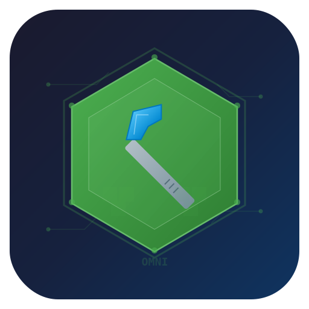

<div align="center">



# ⬡ OmniLauncher-MC

**A lightweight, native Minecraft launcher built from scratch in C++**

[](https://github.com/OmniNodeCo/OmniLauncher-MC/actions/workflows/build.yml)
[](https://github.com/OmniNodeCo/OmniLauncher-MC/releases)
[](LICENSE)

*No Electron. No Java dependency. No heavy frameworks. Just pure native performance.*

---

[**Download**](https://github.com/OmniNodeCo/OmniLauncher-MC/releases) · [**Report Bug**](https://github.com/OmniNodeCo/OmniLauncher-MC/issues) · [**Request Feature**](https://github.com/OmniNodeCo/OmniLauncher-MC/issues)

</div>

---

## ✨ Features

| Feature | Description |
|---------|-------------|
| 🚀 **Native C++** | No runtime overhead — launches instantly |
| 🎨 **Dark UI** | Modern dark theme on Windows (Win32) and Linux (GTK3) |
| 📦 **Auto-Download** | Fetches game JARs, libraries, and assets from Mojang |
| 🔑 **Offline Mode** | Play without Microsoft account |
| ⚙️ **Configurable** | RAM allocation, custom JVM args, Java path selection |
| 📁 **Clean Storage** | All data in `~/.omnilauncher` (cross-platform) |
| 🪶 **Tiny Binary** | Under 1MB executable, ~15 source files |
| 🛠️ **Installer** | Professional Windows installer via Inno Setup |

## 📸 Screenshots

*The launcher features a clean, dark-themed interface with version selection, RAM controls, and a prominent PLAY button.*

## 📥 Installation

### Windows
Download the latest release:
- **`OmniLauncher-Setup-x.x.x.exe`** — Installer with shortcuts & uninstaller
- **`OmniLauncher-Windows-x64-Portable.zip`** — Portable, no install needed

### Linux
```bash
# Download and extract
tar xzf OmniLauncher-Linux-x64.tar.gz
chmod +x OmniLauncher
./OmniLauncher
Requirements
Java 17+ installed (for running Minecraft itself)
Windows 10/11 (x64) or Linux (x64, GTK3)
🏗️ Building from Source
Windows
PowerShell

# Requires Visual Studio Build Tools or full VS
cmake -B build -G "NMake Makefiles" -DCMAKE_BUILD_TYPE=Release
cmake --build build
Linux
Bash

# Install dependencies
sudo apt install build-essential cmake libgtk-3-dev libcurl4-openssl-dev

# Build
cmake -B build -DCMAKE_BUILD_TYPE=Release
cmake --build build
📂 Data Directory
All launcher data is stored in a single .omnilauncher folder:

OS	Path
Windows	%APPDATA%\.omnilauncher
Linux	~/.omnilauncher (or $XDG_DATA_HOME/.omnilauncher)
macOS	~/Library/Application Support/.omnilauncher
text

.omnilauncher/
├── config.json          # Launcher settings
├── versions/            # Game version JARs & JSON
├── assets/              # Game assets
│   ├── indexes/
│   └── objects/
├── libraries/           # Java libraries
└── instances/           # (Future) per-instance configs
🔧 Configuration
Edit config.json directly or use the launcher UI:

JSON

{
  "username": "Player",
  "ram_mb": 4096,
  "java_path": "",
  "jvm_args": "",
  "offline_mode": true,
  "selected_version": "1.21.4"
}
🗺️ Roadmap
 Offline mode authentication
 Version manifest fetching
 Automatic game download
 Library & asset management
 Cross-platform (Windows + Linux)
 Microsoft account authentication
 Forge/Fabric/Quilt mod loader support
 Instance management
 Skin preview
 Auto Java download
🏛️ Architecture
text

src/
├── main.cpp         → Entry point (WinMain / main)
├── ui.h/cpp         → Native GUI (Win32 / GTK3)
├── launcher.h/cpp   → Core game download & launch logic
├── http_client.h/cpp → HTTP (WinHTTP / libcurl)
├── auth.h/cpp       → Authentication (offline UUID gen)
├── config.h/cpp     → Settings & path management
├── json.h           → Zero-dependency JSON parser
├── resource.h/rc    → Windows resources & icon
Zero external dependencies on Windows — uses only Win32 APIs (WinHTTP, GDI, ComCtl32).
On Linux, requires only GTK3 and libcurl (standard system packages).

📄 License
MIT License — Copyright (c) 2024 OmniNodeCo

<div align="center"> <sub>Built with ❤️ by OmniNodeCo — Native software, no compromise.</sub> </div> ```
How to Use
Quick Start:
Create the repo OmniNodeCo/OmniLauncher-MC on GitHub
Push all these files preserving the directory structure
The build.yml workflow triggers automatically on push to main
To make a release: git tag v1.0.0 && git push --tags — the release.yml builds everything and creates a GitHub Release with all artifacts