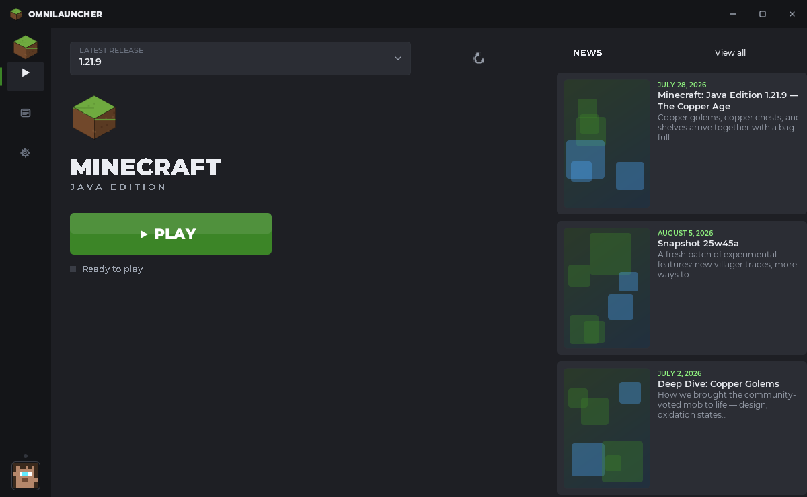
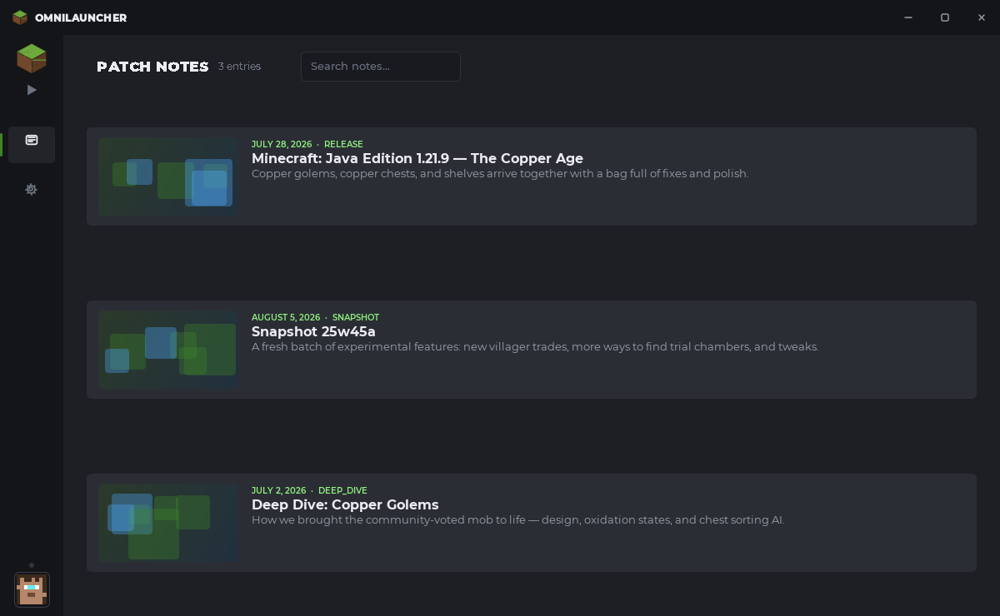
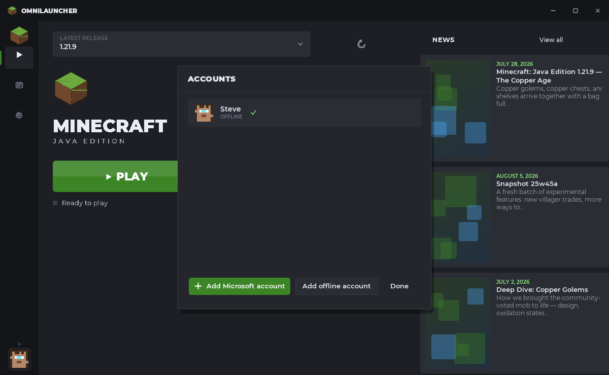

# OmniLauncher 2.0

A **native, dependency-free Minecraft launcher** with a modern custom GUI —
written entirely in Java. No Electron, no HTML, no Python, no Node, no
Maven/Gradle: just the JDK.


| Play | Patch notes | Accounts |
|---|---|---|
|  |  |  |

*More views: [version picker](docs/screenshots/versions.png) ·
[installing](docs/screenshots/installing.png) ·
[settings](docs/screenshots/settings.png) ·
[article reader](docs/screenshots/detail.png)*

**Not an official Minecraft product. Not approved by or associated with Mojang or Microsoft.**

## Highlights

- **Pure Java 17.** The entire launcher — UI, JSON, HTTP, auth, downloads — is
  ~7,000 lines of JDK-only code. Zero third-party dependencies.
- **Custom-painted GUI.** Every control (buttons, sliders, toggles, combo box,
  scrollbars, window chrome) is drawn with Java2D in a Minecraft-launcher-style
  dark theme, with Montserrat typography.
- **Real Mojang API integration.**
  - `version_manifest_v2` with ETag-cached refresh (releases, snapshots, betas)
  - per-version metadata, library + natives classifiers (`${arch}` included)
  - asset indexes with SHA-1 verification
  - official launcher **patch notes / news feed** (`launchercontent.mojang.com`)
- **Automatic Java.** Downloads Mojang's matching bundled runtime
  (`java-runtime-*`, per OS/arch, with checksum markers and executable bits)
  for each version on first play — no manual JVM installs. A configured system
  Java or explicit path still takes precedence.
- **Accounts.** Microsoft sign-in via the OAuth **device-code flow**
  (XBL → XSTS → minecraftservices) with automatic token refresh, plus offline
  accounts. Encrypted-at-rest tokens are sandboxed to your OS user profile.
- **Install & launch engine.** Concurrent downloader (configurable threads),
  `.part` + atomic move, hash/size verification, natives extraction, virtual
  assets for legacy versions, version-accurate JVM/game argument construction.
- **Headless modes.** `--install`, `--launch`, `--preview`, `--selftest` for
  servers, CI and design iteration.

## Build & CI

Requires **JDK 17+** (any vendor). No other tooling.

Three GitHub Actions workflows keep the code honest:

- **Build** (`build.yml`) — static analysis pass where every compiler
  error/warning becomes an inline PR annotation (`scripts/lint.sh`), then
  packages the jar as an artifact.
- **Test** (`test.yml`) — runs the full `--selftest` suite (failing checks are
  annotated on the PR) plus a headless-modes job that renders all seven UI
  pages on a display-less runner.
- **Release** (`release.yml`) — on `v*` tags: lint → build → test gates, then
  publishes the jar to a GitHub Release with generated notes.

```bash
./scripts/build.sh                      # → build/OmniLauncher.jar
java -jar build/OmniLauncher.jar
```

## Run

```bash
java -jar build/OmniLauncher.jar                 # launcher window
java -jar build/OmniLauncher.jar --selftest      # built-in test suite
java -jar build/OmniLauncher.jar --list
java -jar build/OmniLauncher.jar --install 1.21.9
java -jar build/OmniLauncher.jar --launch 1.21.9 --name Steve
java -jar build/OmniLauncher.jar --preview ui.png settings
```

The game installs into your OS data directory (`%APPDATA%/OmniLauncher`,
`~/Library/Application Support/OmniLauncher`, or `~/.config/omnilauncher`);
worlds and saves go to your normal `.minecraft`.

## Microsoft sign-in (optional)

Microsoft accounts use Azure "device code" sign-in. To enable it:

1. Create an app at [Azure Portal → App registrations](https://portal.azure.com/#blade/Microsoft_AAD_RegisteredApps/ApplicationsListBlade)
   (“Personal Microsoft accounts” audience, no redirect URI needed).
2. Enable **Allow public client flows**.
3. Copy the *Application (client) ID* into **Settings → Accounts & Downloads**
   in the launcher, then use **Manage accounts → Add Microsoft account**.
4. A code appears in the launcher; enter it at **microsoft.com/link** in your
   browser and sign in.

Without this you can still add offline accounts and play singleplayer.

## Architecture

```
src/com/omninode/omnilauncher/
├── Main.java            entry point + headless CLI modes
├── api/                 external services
│   ├── VersionManifest  piston-meta manifest (ETag cache)
│   ├── NewsService      official launcher news feed
│   └── MicrosoftAuth    device-code OAuth → XBL → XSTS → MC profile
├── core/                game pipeline
│   ├── VersionJson      Mojang version JSON: rules, natives, arguments
│   ├── VersionInstaller client jar / libraries / assets / natives
│   ├── DownloadEngine   concurrent, verified, cancellable downloads
│   ├── GameLauncher     builds the java command, streams game output
│   ├── RuntimeManager   Mojang java-runtime-* auto-download per version
│   ├── LaunchController play flow state machine
│   ├── Settings, AccountStore, Os, Log
├── model/               Account
├── ui/                  custom-painted Swing GUI
│   ├── Theme, Icons     palette, Montserrat, procedural icon set
│   ├── LauncherWindow, LauncherShell, TitleBar, NavRail
│   ├── PlayPanel        hero, version picker, PLAY/progress morph
│   ├── NewsPanel        patch-notes browser + reader
│   ├── SettingsPanel    Java/game/download settings
│   ├── AccountsDialog   offline + Microsoft device-code sign-in
│   └── components/      buttons, toggles, sliders, combo, scrollbar…
└── util/                Json, Http, Async, Log, Os
```

Design principles:

- **No UI framework** — containers paint their own backgrounds; hit-testing is
  hand-rolled per component. This is what keeps the UI identical on all OSes.
- **JSON is a first-class citizen** — a strict-but-fast parser/serializer in
  ~300 lines, used by every API.
- **Self-verifying downloads** — everything Mojang signs with SHA-1 is checked;
  assets skip re-verification via size fast-path.
- **Integration-tested installer** — `--selftest` boots a local HTTP server and
  runs the full pipeline (manifest → metadata → jars → natives extraction →
  assets → logging config), then re-runs it to prove the fast path skips
  every download.
- **`--selftest`** ships with the jar and runs 137 checks headlessly: the JSON
  engine, Mojang rule semantics, argument construction, the full install
  pipeline against a local HTTP server, the Microsoft device-code chain
  against faked OAuth/Xbox/Minecraft endpoints, and the Java-runtime manager.

## License

MIT — see [LICENSE](LICENSE). Montserrat is bundled under the
[SIL Open Font License](resources/fonts/OFL.txt).
